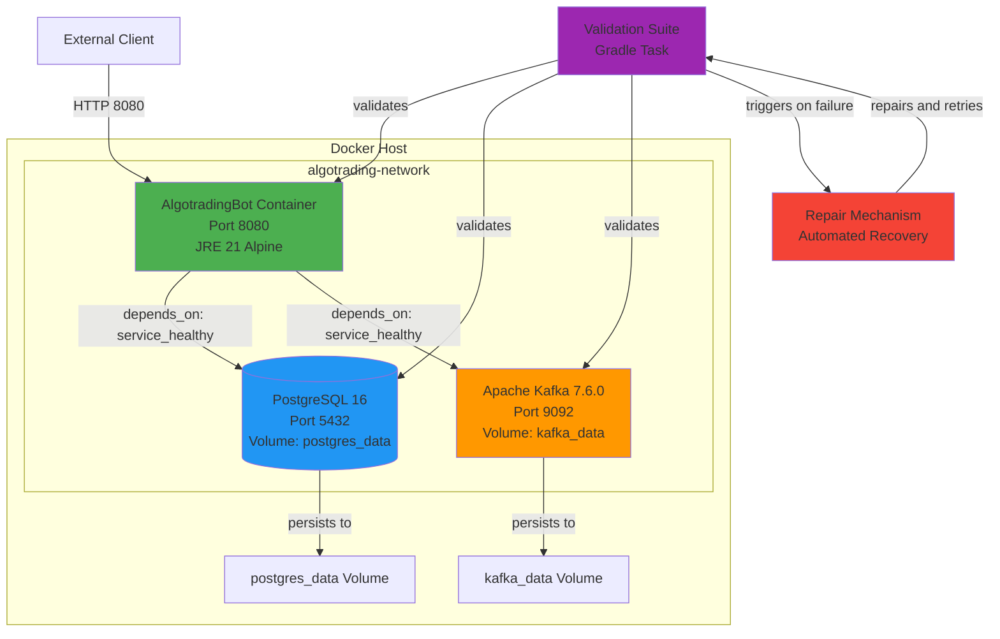
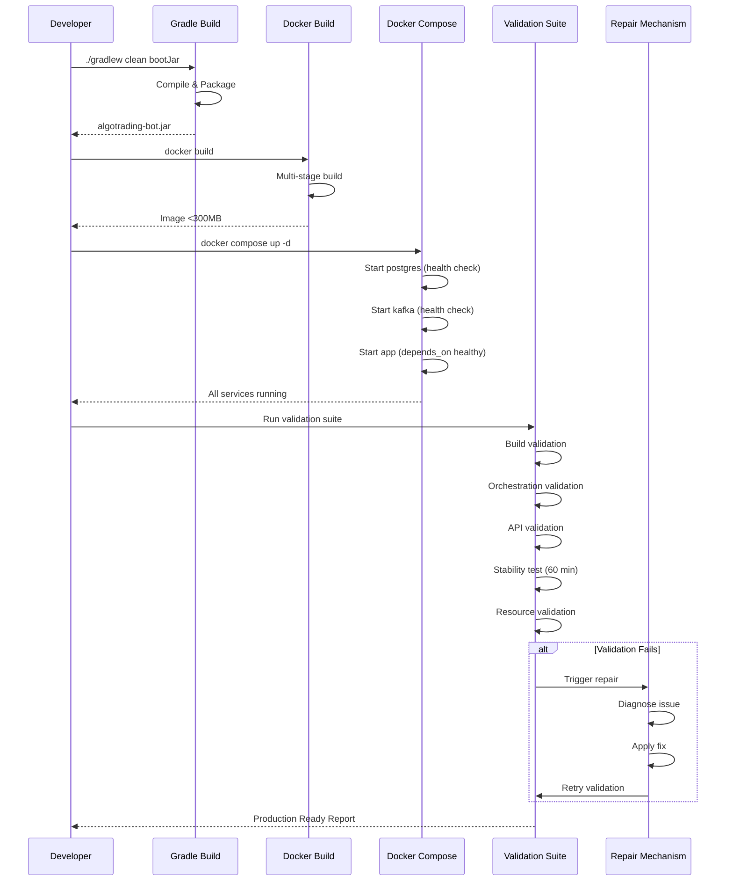

# Design Document: Docker Deployment & Production Readiness

## Overview

This design document specifies the technical architecture for Phase 6 of the AlgotradingBot project: transforming the locally-running Spring Boot application into a production-ready containerized system. The solution encompasses multi-stage Docker builds, service orchestration with health checks, automated validation, and self-healing repair mechanisms to ensure 24/7 operational stability.

The system orchestrates three core services (PostgreSQL, Apache Kafka, and the trading application) with proper dependency management, data persistence, and resource constraints. A comprehensive validation suite verifies production readiness across 20 requirements, including build quality, service orchestration, API functionality, long-running stability, and resource usage. An automated repair mechanism detects and resolves common issues without manual intervention.

### Key Design Goals

1. **Optimized Container Images**: Multi-stage builds minimize image size (<300MB) while maintaining full functionality
2. **Reliable Service Orchestration**: Health-check-based dependency management ensures services start in correct order
3. **Data Persistence**: Named volumes preserve trade history and account data across container restarts
4. **Automated Validation**: Comprehensive test suite verifies all 20 production readiness requirements
5. **Self-Healing**: Automated repair mechanisms resolve transient failures and retry validations
6. **Production Stability**: 60-minute stability tests verify long-term operational reliability

## Architecture

### System Components

The production deployment consists of four primary components:

1. **Multi-Stage Docker Build System**
   - Builder stage: Gradle 8.5 + JDK 21 for compilation
   - Runtime stage: Eclipse Temurin JRE 21 Alpine for minimal footprint
   - Security: Non-root user execution
   - Health monitoring: Built-in health check using Actuator endpoint

2. **Service Orchestration Layer (Docker Compose)**
   - PostgreSQL 16: Persistent data storage with health checks
   - Apache Kafka 7.6.0: Event streaming with KRaft mode (no Zookeeper)
   - AlgotradingBot Application: Spring Boot 4.0.3 with graceful shutdown
   - Custom bridge network: Isolated inter-service communication

3. **Validation Suite**
   - Build validation: JAR creation, size checks, content verification
   - Orchestration validation: Service startup order, health status, connectivity
   - API validation: Endpoint functionality, response correctness
   - Stability validation: 60-minute continuous operation test
   - Resource validation: Memory, CPU, and disk usage monitoring

4. **Automated Repair Mechanism**
   - Build repair: Gradle cache cleanup and rebuild
   - Image repair: Docker image pruning and rebuild
   - Service repair: Container restart and orchestration reset
   - Health repair: Individual container restart on health check failure
   - Retry logic: Up to 3 repair cycles before failure reporting

### Architecture Diagram



### Deployment Flow



## Components and Interfaces

### 1. Multi-Stage Dockerfile

**Purpose**: Build optimized, secure container image for the trading application.

**Builder Stage**:
- Base image: `gradle:8.5-jdk21`
- Responsibilities:
  - Copy Gradle wrapper and build files
  - Download dependencies (cached layer)
  - Copy source code
  - Execute `./gradlew bootJar --no-daemon`
- Output: `build/libs/algotrading-bot.jar`

**Runtime Stage**:
- Base image: `eclipse-temurin:21-jre-alpine`
- Responsibilities:
  - Create non-root user (`spring:spring`)
  - Copy JAR from builder stage
  - Set ownership to non-root user
  - Configure JVM options via `JAVA_OPTS`
  - Expose port 8080
  - Define health check using wget
- Health check configuration:
  - Interval: 30 seconds
  - Timeout: 10 seconds
  - Start period: 60 seconds
  - Retries: 3
  - Command: `wget --no-verbose --tries=1 --spider http://localhost:8080/actuator/health`

**Interface**:
```dockerfile
# Build stage
FROM gradle:8.5-jdk21 AS build
WORKDIR /app
COPY gradlew gradlew.bat ./
COPY gradle ./gradle
COPY build.gradle.kts settings.gradle.kts ./
RUN ./gradlew dependencies --no-daemon || true
COPY src ./src
RUN ./gradlew bootJar --no-daemon

# Runtime stage
FROM eclipse-temurin:21-jre-alpine
RUN addgroup -S spring && adduser -S spring -G spring
WORKDIR /app
COPY --from=build /app/build/libs/algotrading-bot.jar app.jar
RUN chown spring:spring app.jar
USER spring:spring
EXPOSE 8080
ENV JAVA_OPTS="-Xmx512m -Xms256m"
HEALTHCHECK --interval=30s --timeout=10s --start-period=60s --retries=3 \
  CMD wget --no-verbose --tries=1 --spider http://localhost:8080/actuator/health || exit 1
ENTRYPOINT ["sh", "-c", "java $JAVA_OPTS -jar app.jar"]
```

### 2. Docker Compose Orchestration

**Purpose**: Coordinate multi-service deployment with proper dependency management.

**Services**:

**PostgreSQL Service**:
- Image: `postgres:16`
- Container name: `algotrading-postgres`
- Environment variables:
  - `POSTGRES_DB=algotrading`
  - `POSTGRES_USER=postgres`
  - `POSTGRES_PASSWORD=postgres`
- Ports: `5432:5432`
- Volume: `postgres_data:/var/lib/postgresql/data`
- Health check:
  - Test: `pg_isready -U postgres`
  - Interval: 10 seconds
  - Timeout: 5 seconds
  - Retries: 5
- Restart policy: `unless-stopped`

**Kafka Service**:
- Image: `confluentinc/cp-kafka:7.6.0`
- Container name: `algotrading-kafka`
- Ports: `9092:9092`
- Environment: KRaft mode configuration (no Zookeeper)
- Volume: `kafka_data:/var/lib/kafka/data`
- Health check:
  - Test: `kafka-broker-api-versions --bootstrap-server localhost:9092`
  - Interval: 10 seconds
  - Timeout: 10 seconds
  - Retries: 5
- Restart policy: `unless-stopped`

**Application Service**:
- Build: Current directory Dockerfile
- Container name: `algotrading-app`
- Depends on: `postgres:service_healthy`, `kafka:service_healthy`
- Ports: `8080:8080`
- Environment variables:
  - `SPRING_DATASOURCE_URL=jdbc:postgresql://postgres:5432/algotrading`
  - `SPRING_DATASOURCE_USERNAME=postgres`
  - `SPRING_DATASOURCE_PASSWORD=postgres`
  - `SPRING_KAFKA_BOOTSTRAP_SERVERS=kafka:29092`
  - `JAVA_OPTS=-Xmx512m -Xms256m`
- Health check: Inherited from Dockerfile
- Restart policy: `unless-stopped`
- Stop grace period: 30 seconds

**Network**:
- Name: `algotrading-network`
- Driver: `bridge`
- Internal service communication via hostnames

**Volumes**:
- `postgres_data`: Driver `local`, persists PostgreSQL data
- `kafka_data`: Driver `local`, persists Kafka logs

**Interface**:
```yaml
version: '3.8'

services:
  postgres:
    image: postgres:16
    container_name: algotrading-postgres
    environment:
      POSTGRES_DB: algotrading
      POSTGRES_USER: postgres
      POSTGRES_PASSWORD: postgres
    ports:
      - "5432:5432"
    volumes:
      - postgres_data:/var/lib/postgresql/data
    healthcheck:
      test: ["CMD-SHELL", "pg_isready -U postgres"]
      interval: 10s
      timeout: 5s
      retries: 5
    restart: unless-stopped
    networks:
      - algotrading-network

  kafka:
    image: confluentinc/cp-kafka:7.6.0
    container_name: algotrading-kafka
    ports:
      - "9092:9092"
    environment:
      # KRaft configuration
    volumes:
      - kafka_data:/var/lib/kafka/data
    healthcheck:
      test: ["CMD-SHELL", "kafka-broker-api-versions --bootstrap-server localhost:9092"]
      interval: 10s
      timeout: 10s
      retries: 5
    restart: unless-stopped
    networks:
      - algotrading-network

  algotrading-app:
    build: .
    container_name: algotrading-app
    depends_on:
      postgres:
        condition: service_healthy
      kafka:
        condition: service_healthy
    ports:
      - "8080:8080"
    environment:
      SPRING_DATASOURCE_URL: jdbc:postgresql://postgres:5432/algotrading
      SPRING_DATASOURCE_USERNAME: postgres
      SPRING_DATASOURCE_PASSWORD: postgres
      SPRING_KAFKA_BOOTSTRAP_SERVERS: kafka:29092
      JAVA_OPTS: -Xmx512m -Xms256m
    restart: unless-stopped
    stop_grace_period: 30s
    networks:
      - algotrading-network

networks:
  algotrading-network:
    driver: bridge

volumes:
  postgres_data:
    driver: local
  kafka_data:
    driver: local
```

### 3. Validation Suite

**Purpose**: Automated testing framework that verifies all 20 production readiness requirements.

**Implementation**: Gradle task `validateProduction` that orchestrates validation steps.

**Components**:

**BuildValidator**:
- Responsibilities:
  - Execute `./gradlew clean bootJar`
  - Verify JAR file exists at `build/libs/algotrading-bot.jar`
  - Check JAR size is between 30MB and 100MB
  - Verify JAR contains Spring Boot classes using `jar tf`
  - Execute `docker build -t algotrading-bot:latest .`
  - Verify Docker image size < 300MB using `docker images`
- Interface:
```java
public class BuildValidator {
    public ValidationResult validateBuild();
    public ValidationResult validateJarFile(Path jarPath);
    public ValidationResult validateDockerImage(String imageName);
}
```

**OrchestrationValidator**:
- Responsibilities:
  - Execute `docker compose up -d`
  - Poll PostgreSQL health status (max 60 seconds)
  - Poll Kafka health status (max 90 seconds)
  - Poll Application health status (max 120 seconds)
  - Verify all containers running via `docker ps`
  - Check application logs for database connection success
  - Check application logs for Kafka connection success
- Interface:
```java
public class OrchestrationValidator {
    public ValidationResult validateServiceStartup();
    public ValidationResult validateServiceHealth(String serviceName, Duration timeout);
    public ValidationResult validateServiceLogs(String serviceName, List<String> expectedMessages);
}
```

**ApiValidator**:
- Responsibilities:
  - Call `GET /actuator/health` and verify 200 status
  - Verify health response contains `"status":"UP"`
  - Call `GET /api/strategy/status` and verify 200 status
  - Verify strategy status returns valid JSON
  - Call `POST /api/strategy/start` with test parameters
  - Verify start response indicates success
  - Call `POST /api/strategy/stop` and verify graceful shutdown
- Interface:
```java
public class ApiValidator {
    public ValidationResult validateHealthEndpoint();
    public ValidationResult validateStrategyStatus();
    public ValidationResult validateStrategyLifecycle();
}
```

**StabilityValidator**:
- Responsibilities:
  - Run continuous monitoring for 60 minutes
  - Check container health every 5 minutes
  - Monitor memory usage via `docker stats` (app < 512MB, db < 256MB, kafka < 512MB)
  - Monitor CPU usage (all services < 80%)
  - Verify no container restarts occurred
  - Scan application logs for ERROR level messages
  - Verify database connections remain stable
  - Verify Kafka connections remain stable
  - Generate stability report with metrics
- Interface:
```java
public class StabilityValidator {
    public ValidationResult runStabilityTest(Duration duration);
    public ResourceMetrics collectResourceMetrics();
    public ValidationResult validateNoRestarts();
    public ValidationResult validateNoErrors();
    public StabilityReport generateReport();
}
```

**ResourceValidator**:
- Responsibilities:
  - Execute `docker stats --no-stream` for all containers
  - Parse memory usage for each container
  - Verify application container < 512MB
  - Verify database container < 256MB
  - Verify Kafka container < 512MB
  - Verify total system usage < 1.5GB
  - Measure disk space for volumes using `docker system df -v`
  - Verify total disk usage < 2GB
- Interface:
```java
public class ResourceValidator {
    public ValidationResult validateMemoryUsage();
    public ValidationResult validateDiskUsage();
    public ResourceReport generateResourceReport();
}
```

**DataPersistenceValidator**:
- Responsibilities:
  - Insert test trade data via API
  - Execute `docker compose restart postgres`
  - Wait for PostgreSQL to become healthy
  - Query test trade data via API
  - Verify data still exists
  - Execute `docker compose restart algotrading-app`
  - Wait for application to become healthy
  - Verify application reconnects to database
  - Verify trade data queryable after restart
- Interface:
```java
public class DataPersistenceValidator {
    public ValidationResult validateDatabasePersistence();
    public ValidationResult validateApplicationReconnection();
}
```

### 4. Automated Repair Mechanism

**Purpose**: Detect and resolve common deployment issues automatically.

**RepairEngine**:
- Responsibilities:
  - Receive validation failure from any validator
  - Diagnose root cause based on failure type
  - Apply appropriate repair action
  - Retry validation after repair
  - Track repair attempts (max 3 cycles)
  - Generate detailed failure report if all repairs fail
- Interface:
```java
public class RepairEngine {
    public RepairResult repairBuildFailure(ValidationResult failure);
    public RepairResult repairOrchestrationFailure(ValidationResult failure);
    public RepairResult repairHealthCheckFailure(ValidationResult failure);
    public RepairResult repairApiFailure(ValidationResult failure);
    public boolean shouldRetry(int attemptCount);
    public FailureReport generateFailureReport(List<RepairAttempt> attempts);
}
```

**Repair Actions**:

1. **Build Failure Repair**:
   - Execute `./gradlew clean`
   - Clear Gradle cache: `rm -rf ~/.gradle/caches`
   - Retry `./gradlew bootJar`
   - If still fails, check disk space and report

2. **Docker Image Failure Repair**:
   - Execute `docker image prune -f` to remove dangling images
   - Retry `docker build`
   - If still fails, check Docker daemon status

3. **Orchestration Failure Repair**:
   - Execute `docker compose down`
   - Wait 5 seconds
   - Execute `docker compose up -d`
   - If still fails, check port conflicts

4. **Health Check Failure Repair**:
   - Execute `docker compose restart <service>`
   - Wait for health check to pass
   - If still fails, check service logs for errors

5. **API Failure Repair**:
   - Check application logs for exceptions
   - Execute `docker compose restart algotrading-app`
   - Wait for health check to pass
   - Retry API calls

**Repair Logging**:
- All repair actions logged with timestamps
- Reason for repair logged
- Repair action taken logged
- Repair result logged
- Format: JSON structured logs for parsing

### 5. Production Readiness Report

**Purpose**: Comprehensive report summarizing validation results and production readiness status.

**ProductionReadinessReport**:
- Responsibilities:
  - Aggregate results from all validators
  - Calculate overall pass/fail status
  - Generate summary statistics
  - Include environment information
  - Timestamp report generation
  - Display final PRODUCTION READY or NOT READY status
- Interface:
```java
public class ProductionReadinessReport {
    private Map<String, ValidationResult> requirementResults;
    private ResourceMetrics resourceMetrics;
    private StabilityMetrics stabilityMetrics;
    private LocalDateTime timestamp;
    private String environment;
    
    public boolean isProductionReady();
    public String generateTextReport();
    public String generateJsonReport();
    public void saveToFile(Path outputPath);
}
```

**Report Format**:
```
=== PRODUCTION READINESS REPORT ===
Generated: 2025-12-05T14:30:00Z
Environment: Docker 24.0.7, Docker Compose 2.23.0

BUILD VALIDATION:
[OK] JAR file created successfully (45.2 MB)
[OK] Docker image built successfully (287 MB)

ORCHESTRATION VALIDATION:
[OK] PostgreSQL healthy in 12 seconds
[OK] Kafka healthy in 45 seconds
[OK] Application healthy in 78 seconds

API VALIDATION:
[OK] Health endpoint responding (200 OK)
[OK] Strategy status endpoint responding (200 OK)
[OK] Strategy lifecycle working correctly

STABILITY VALIDATION:
[OK] 60-minute test completed
[OK] No container restarts
[OK] No ERROR level logs
[OK] Memory usage stable (avg 423 MB)
[OK] CPU usage stable (avg 34%)

RESOURCE VALIDATION:
[OK] Application memory: 412 MB (< 512 MB)
[OK] Database memory: 187 MB (< 256 MB)
[OK] Kafka memory: 456 MB (< 512 MB)
[OK] Total memory: 1055 MB (< 1.5 GB)
[OK] Disk usage: 1.2 GB (< 2 GB)

DATA PERSISTENCE VALIDATION:
[OK] Database restart preserves data
[OK] Application reconnects after restart

OVERALL STATUS: [OK] PRODUCTION READY

All 20 requirements passed.
System is ready for production deployment.
```

## Data Models

### ValidationResult

Represents the outcome of a single validation check.

```java
public class ValidationResult {
    private String requirementId;      // e.g., "REQ-1.1"
    private String requirementName;    // e.g., "Multi-stage build uses Gradle"
    private ValidationStatus status;   // PASSED, FAILED, SKIPPED
    private String message;            // Human-readable result
    private LocalDateTime timestamp;
    private Duration executionTime;
    private Map<String, Object> metadata; // Additional context
    
    public boolean isPassed();
    public boolean isFailed();
}

public enum ValidationStatus {
    PASSED,
    FAILED,
    SKIPPED
}
```

### ResourceMetrics

Captures resource usage data for containers.

```java
public class ResourceMetrics {
    private ContainerMetrics applicationMetrics;
    private ContainerMetrics databaseMetrics;
    private ContainerMetrics kafkaMetrics;
    private long totalMemoryUsageMB;
    private long totalDiskUsageGB;
    private LocalDateTime collectedAt;
    
    public boolean isWithinLimits();
}

public class ContainerMetrics {
    private String containerName;
    private long memoryUsageMB;
    private double cpuUsagePercent;
    private long diskUsageMB;
    private int restartCount;
    
    public boolean isHealthy();
}
```

### StabilityMetrics

Tracks stability test results over time.

```java
public class StabilityMetrics {
    private Duration testDuration;
    private List<HealthCheckResult> healthChecks;
    private List<ResourceSnapshot> resourceSnapshots;
    private int containerRestarts;
    private int errorLogCount;
    private boolean databaseConnectionStable;
    private boolean kafkaConnectionStable;
    
    public boolean isStable();
    public double getAverageMemoryUsageMB();
    public double getAverageCpuUsagePercent();
}

public class HealthCheckResult {
    private LocalDateTime timestamp;
    private String serviceName;
    private boolean healthy;
    private String statusMessage;
}

public class ResourceSnapshot {
    private LocalDateTime timestamp;
    private Map<String, ContainerMetrics> containerMetrics;
}
```

### RepairAttempt

Records a repair action and its outcome.

```java
public class RepairAttempt {
    private int attemptNumber;
    private ValidationResult triggeringFailure;
    private RepairAction actionTaken;
    private LocalDateTime timestamp;
    private Duration executionTime;
    private RepairResult result;
    private String logOutput;
    
    public boolean wasSuccessful();
}

public enum RepairAction {
    CLEAN_GRADLE_CACHE,
    REBUILD_JAR,
    PRUNE_DOCKER_IMAGES,
    REBUILD_DOCKER_IMAGE,
    RESTART_SERVICES,
    RESTART_CONTAINER,
    CHECK_LOGS
}

public class RepairResult {
    private boolean successful;
    private String message;
    private ValidationResult retryResult;
}
```

### FailureReport

Generated when all repair attempts fail.

```java
public class FailureReport {
    private ValidationResult originalFailure;
    private List<RepairAttempt> repairAttempts;
    private LocalDateTime timestamp;
    private String environment;
    private Map<String, String> systemInfo;
    private List<String> diagnosticLogs;
    
    public String generateDetailedReport();
    public void saveToFile(Path outputPath);
}
```


