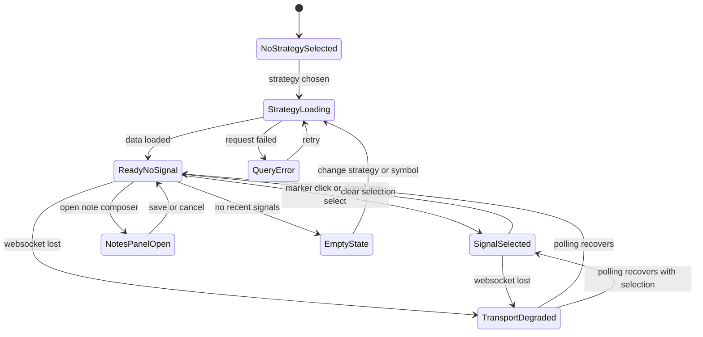
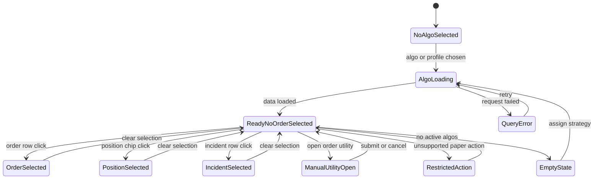
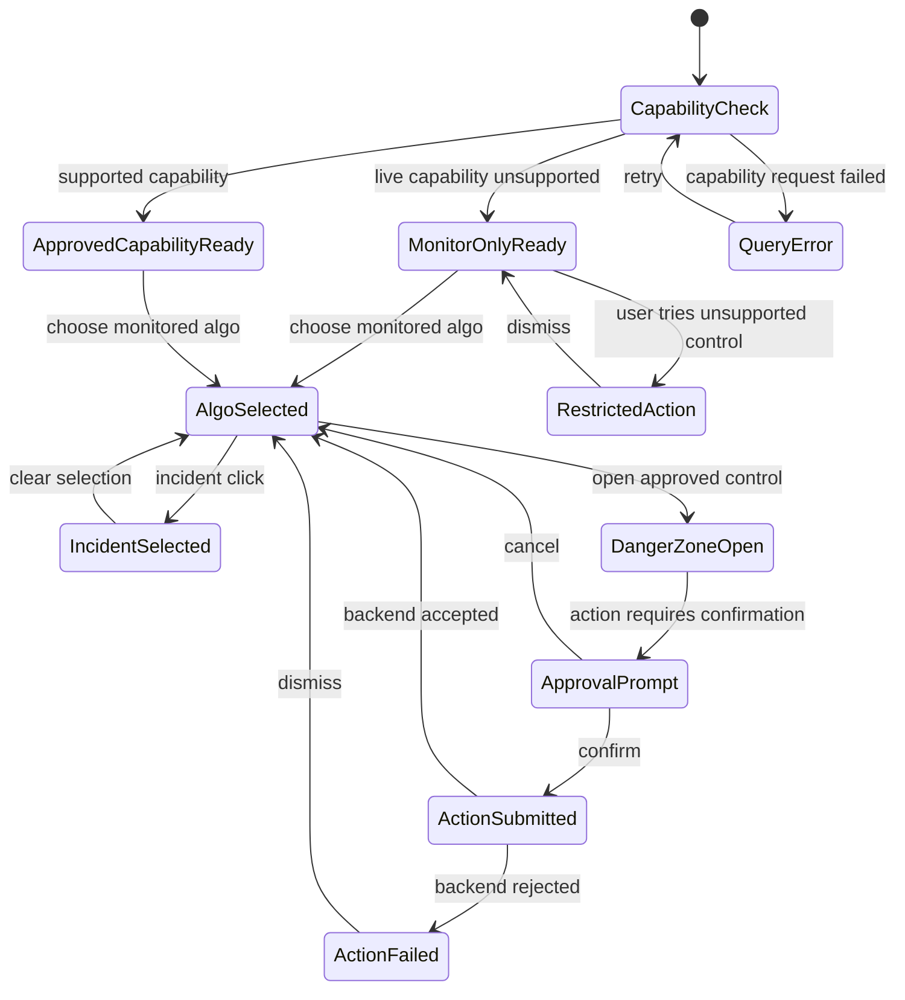

# Execution Workspace Wireframes And State Diagrams

Design date: March 26, 2026

This document defines the wireframes and route-state diagrams required by `FEATURE_DEVELOPMENT_PLAN.md` task `2A.3`.
It builds directly on the baseline documented in:

- `PLAN.md`
- `docs/WORKSTATION_EXPERIENCE_AUDIT.md`
- `docs/EXECUTION_WORKSPACE_INFORMATION_ARCHITECTURE.md`

The goal is to give later implementation tasks a concrete UI contract before route and component work begins.

## Scope

The execution workspace is the new route family:

- `/execution/forward-testing`
- `/execution/paper`
- `/execution/live`

This document defines:

- desktop wireframes
- mobile wireframes
- dominant panel hierarchy
- selection and drill-down behavior
- failure, empty, and restricted-capability states

## Shared Shell Rules

These rules apply to every execution tab:

- The global shell header keeps route title, subtitle, mode, telemetry, risk, and exchange chips.
- The execution route adds a route-local tab bar and action bar below the shell header.
- Route-local panels must not recreate a competing hero block.
- Environment, risk, connection, and capability cues stay visible at all times through a combination of shell chips and one compact route-local posture strip.

## Shared Route Frame

Desktop frame:

```text
+----------------------------------------------------------------------------------+
| Shell header: title, subtitle, mode, telemetry, risk, exchange, account menu   |
+----------------------------------------------------------------------------------+
| Execution tabs: Forward Testing | Paper | Live                                  |
+----------------------------------------------------------------------------------+
| Route action bar: selected algo | profile | symbol | status | actions           |
+----------------------------------------------------------------------------------+
| Primary workspace                                                        | Rail  |
|                                                                          |       |
|                                                                          |       |
+----------------------------------------------------------------------------------+
| Secondary evidence zone: logs, orders, incidents, notes, history, stats         |
+----------------------------------------------------------------------------------+
```

Mobile frame:

```text
+---------------------------------------------+
| Shell header                                |
+---------------------------------------------+
| Execution tabs                              |
+---------------------------------------------+
| Route action bar                            |
+---------------------------------------------+
| Primary workspace                           |
+---------------------------------------------+
| Secondary workspace accordion or tabs       |
+---------------------------------------------+
| Inspector bottom sheet trigger              |
+---------------------------------------------+
```

Shared layout rules:

- One primary workspace dominates the viewport.
- One secondary evidence zone sits below on desktop and behind segmented sections on mobile.
- The inspector becomes a sticky right rail on desktop and a bottom sheet on mobile.
- The route action bar is sticky on scroll for all three tabs.

## Shared Interaction States

The execution workspace uses the same route-state grammar across all tabs:

- no selection
- selection loading
- ready with selection
- empty results
- degraded transport
- failed query
- restricted capability

Common search-param model:

- `strategy`
- `algo`
- `exchangeProfile`
- `symbol`
- `incident`
- `marker`
- `panel`

Shared route-local posture strip content:

- execution context label
- selected strategy or algorithm label
- capability state
- data freshness
- last incident or stale-state cue when present

## Forward Testing

### Dominant Job

Observe strategy behavior and investigate signals without placing live orders.

### Desktop Wireframe

```text
+--------------------------------------------------------------------------------------------------+
| Route action bar: Forward Testing | strategy version | symbol | freshness | Add note | Share    |
+--------------------------------------------------------------------------------------------------+
| Live or near-live chart workspace                                                        | Context |
| - candlesticks                                                                           | rail    |
| - signal markers                                                                         |         |
| - indicator overlays                                                                     | - strat |
| - marker filters                                                                         | - regime|
| - linked crosshair                                                                       | - notes |
|                                                                                          | - risks |
+--------------------------------------------------------------------------------------------------+
| Investigation timeline                            | Signal detail / indicator evidence             |
| - note feed                                       | - selected signal reason                       |
| - annotations                                     | - indicator snapshot                           |
| - incident tags                                   | - entry or stand-aside explanation             |
+--------------------------------------------------------------------------------------------------+
```

### Mobile Wireframe

```text
+----------------------------------------------------------------------------------+
| Action bar: strategy | symbol | freshness                                        |
+----------------------------------------------------------------------------------+
| Chart workspace with marker toggle chips                                          |
+----------------------------------------------------------------------------------+
| Segments: Signals | Notes | Context                                               |
+----------------------------------------------------------------------------------+
| Selected signal preview card                                                      |
+----------------------------------------------------------------------------------+
| Bottom sheet inspector: reason, indicators, incidents, note history               |
+----------------------------------------------------------------------------------+
```

### Panel Ownership

Primary panels:

- chart workspace
- selected signal evidence

Secondary panels:

- investigation timeline
- operator notes
- strategy context rail

Danger-zone behavior:

- no order controls
- no live execution controls
- no silent fallback into paper execution

### Selection And Drill-Down State Diagram



### Failure And Empty States

- No strategy selected:
  Show one guided empty state with recommended strategies or recent watched strategies.
- No recent signals:
  Keep chart visible if price data exists, with an explanation that the strategy stood aside.
- Data feed delayed:
  Show stale badge and last update time in the action bar.
- WebSocket unavailable:
  Keep signal review available through polling and mark the transport as degraded.

## Paper

### Dominant Job

Review and control simulated execution behavior for active paper algorithms and accounts.

### Desktop Wireframe

```text
+--------------------------------------------------------------------------------------------------+
| Route action bar: Paper | exchange profile | algo | status | Assign strategy | Manual utility   |
+--------------------------------------------------------------------------------------------------+
| Active paper algorithms or accounts list                                               | Inspector |
| - status                                                                                | rail      |
| - pnl                                                                                   |          |
| - stale or incident badges                                                              | - current |
| - position summary                                                                      | position  |
| - selection state                                                                       | - orders  |
+--------------------------------------------------------------------------------------------------+
| Selected algorithm chart and signal-to-order evidence                                  | Summary   |
| - price chart with signal and order markers                                             | cards     |
| - current position overlays                                                             |           |
| - incident markers                                                                      |           |
+--------------------------------------------------------------------------------------------------+
| Orders and fills table                         | Incidents and recovery log                         |
+--------------------------------------------------------------------------------------------------+
```

### Mobile Wireframe

```text
+----------------------------------------------------------------------------------+
| Action bar: exchange | algo | status                                             |
+----------------------------------------------------------------------------------+
| Active algorithm cards list                                                       |
+----------------------------------------------------------------------------------+
| Selected algorithm summary card                                                   |
+----------------------------------------------------------------------------------+
| Chart workspace                                                                   |
+----------------------------------------------------------------------------------+
| Segments: Orders | Fills | Incidents | Utility                                    |
+----------------------------------------------------------------------------------+
| Bottom sheet inspector: position, pnl, risk, latest signal or order reason        |
+----------------------------------------------------------------------------------+
```

### Panel Ownership

Primary panels:

- active algorithm list
- selected algorithm chart and explainability workspace

Secondary panels:

- orders and fills table
- incidents and recovery log
- manual paper utility actions

Danger-zone behavior:

- manual paper utility remains secondary
- destructive stop or unassign controls require explicit confirmation

### Selection And Drill-Down State Diagram



### Failure And Empty States

- No active paper algorithms:
  Show assignment guidance and a link back to strategy configuration.
- Algo selected but no orders yet:
  Show live or near-live chart plus standing-aside explanation.
- Incident or stale state present:
  Promote the incident log ahead of the orders table on both desktop and mobile.
- Backend rejects a paper action:
  Keep the failure message inline in the utility band and preserve current selection.

## Live

### Dominant Job

Monitor explicit live context and fail closed unless approved live capabilities exist.

### Desktop Wireframe

```text
+--------------------------------------------------------------------------------------------------+
| Route action bar: Live | capability posture | exchange | algo | last sync | Open runbook        |
+--------------------------------------------------------------------------------------------------+
| Capability posture panel                                                                       |
| - monitor-only or approved capability                                                          |
| - approval source                                                                              |
| - operator warning copy                                                                        |
+--------------------------------------------------------------------------------------------------+
| Live monitored algorithms or accounts list                                            | Inspector |
| - status                                                                                | rail      |
| - incident severity                                                                      |          |
| - position summary                                                                       | - signal  |
| - pnl                                                                                   | - risk    |
+--------------------------------------------------------------------------------------------------+
| Selected monitoring workspace                                                              | Danger  |
| - chart with live markers                                                                  | zone    |
| - fills, incidents, risk overlays                                                          |         |
| - monitor-only explanation when controls unavailable                                       |         |
+--------------------------------------------------------------------------------------------------+
| Incident timeline                                | Audit / capability events                    |
+--------------------------------------------------------------------------------------------------+
```

### Mobile Wireframe

```text
+----------------------------------------------------------------------------------+
| Action bar: capability | exchange | algo                                          |
+----------------------------------------------------------------------------------+
| Capability posture card                                                            |
+----------------------------------------------------------------------------------+
| Monitored algorithm cards                                                          |
+----------------------------------------------------------------------------------+
| Selected monitoring chart                                                          |
+----------------------------------------------------------------------------------+
| Segments: Incidents | Audit | Risk | Controls                                      |
+----------------------------------------------------------------------------------+
| Bottom sheet inspector: current state, signal reason, capability explanation       |
+----------------------------------------------------------------------------------+
```

### Panel Ownership

Primary panels:

- capability posture
- monitored algorithm list
- selected monitoring chart

Secondary panels:

- incident timeline
- audit or capability history
- isolated danger zone

Danger-zone behavior:

- unsupported controls render as disabled with explicit explanation
- approved live controls, if they exist later, live in one isolated panel only
- no control is shown by inference from paper capability

### Selection And Drill-Down State Diagram



### Failure And Empty States

- Capability check failed:
  The route shows a blocking error state and no dangerous controls.
- Monitor-only mode:
  The danger zone remains present only as explanatory locked controls.
- No monitored algorithms:
  Show monitor-only onboarding and the requirement for explicit backend support.
- Live incidents present:
  Incident timeline rises above audit history in visual order.

## Cross-Tab Selection Rules

The three tabs share a consistent selection model:

- clicking a list row selects one strategy or algorithm and updates search params
- clicking a chart marker selects the matching signal, order, or incident in the inspector
- clearing selection never resets the selected tab or route-owned context
- search params must be stable enough to support copyable deep links

Cross-tab persistence rules:

- changing tabs preserves `exchangeProfile` when it still applies
- changing tabs drops incompatible params such as `marker` or `incident`
- returning to a tab may restore the last compatible selection from search params

## Failure-Mode Matrix

| State | Forward Testing | Paper | Live |
| --- | --- | --- | --- |
| No data yet | Guided empty state with strategy selection | Guided empty state with assignment CTA | Guided empty state with capability guidance |
| Query failed | Inline retry banner above chart | Inline retry banner above list | Blocking capability-safe error state |
| WebSocket lost | Polling fallback with stale badge | Polling fallback with stale badge | Polling fallback with capability posture unchanged |
| Backend rejects action | No actions expected beyond notes | Utility band shows inline failure | Danger zone shows explicit rejection |
| Unsupported capability | Not applicable beyond data feed limits | Disabled utility with explanation | Disabled live controls with explanation |

## Accessibility And Responsiveness Requirements

- Tabs are keyboard reachable and expose `aria-current` or selected state clearly.
- The sticky route action bar must not trap focus.
- Bottom-sheet inspector on mobile must preserve access to the route tabs and action bar after close.
- Dense lists need an obvious selected-row treatment that does not rely on color alone.
- Capability and incident states must use iconography and plain-language labels in addition to color.
- Mobile segmented sections must preserve the dominant task order rather than flattening all panels into one long scroll.

## Acceptance Check Against `2A.3`

This document satisfies the task goals by defining:

- detailed desktop and mobile wireframes for `Forward Testing`, `Paper`, and `Live`
- primary panels, secondary panels, chart behavior, log views, and danger-zone behavior for each tab
- route-state diagrams for selection, drill-down, degraded transport, empty states, and failure handling
- a visibility model that keeps environment, risk, connection, and capability cues present without duplicating shell chrome
